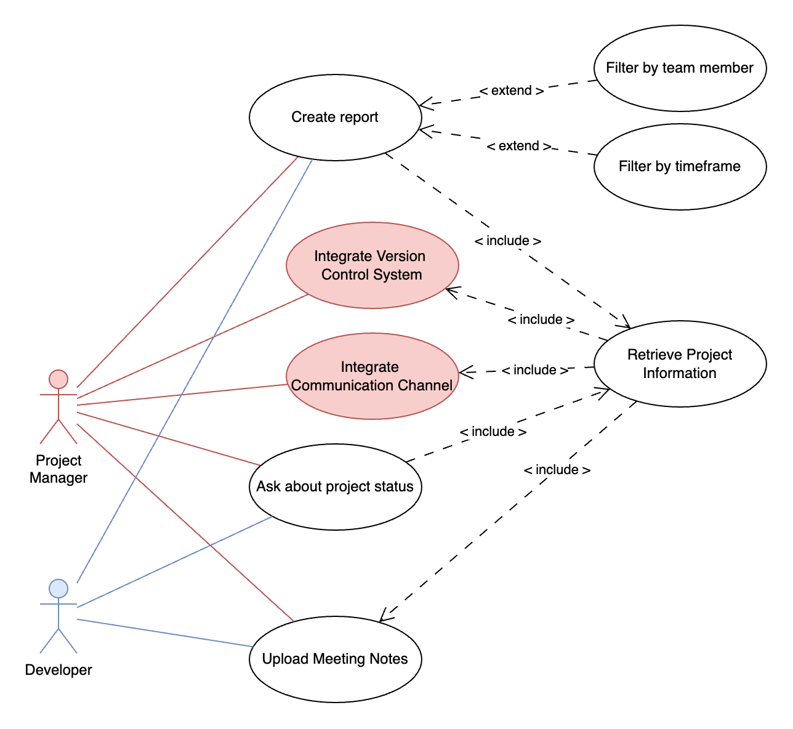

# TRACE – Team Reporting & Activity Context Engine

Modern development teams use a variety of platforms such as GitHub (code and issues), Discord (communication), and meeting notes to manage their projects. However, tracking team members' contributions, understanding project progress, and getting answers to questions like “Has issue X been resolved?” or “What has Person Y done this week?” requires manually combing through disparate sources, which is inefficient and error-prone.

The goal of this project is to create a system that can summarize the progress of a programming project. Therefore the software collects data from communication channels, repositories and meeting notes. The system will then use a GenAI service to summarize the data and provide concise overview of the projects status.

## Table of Contents

- [TRACE – Team Reporting & Activity Context Engine](#trace--team-reporting--activity-context-engine)
  - [Table of Contents](#table-of-contents)
  - [Usage](#usage)
  - [Setup](#setup)
  - [System Design](#system-design)
    - [Architecture](#architecture)
    - [CI/CD Pipeline](#cicd-pipeline)
  - [Requirements Analysis](#requirements-analysis)
    - [Main Functionality](#main-functionality)
    - [Intended Users](#intended-users)
    - [GenAI Integration](#genai-integration)
    - [Scenarios](#scenarios)
    - [Functional Requirements](#functional-requirements)
  - [Contributors](#contributors)

## Usage

The system can be accessed at [https://trace.student.k8s.aet.cit.tum.de](https://trace.student.k8s.aet.cit.tum.de). \
The API documentation can be accessed at [https://trace.student.k8s.aet.cit.tum.de/api/docs](https://trace.student.k8s.aet.cit.tum.de/api/docs).

## Setup

The easiest way to get the system started is using `docker`. For that use the following commands:

```bash
cp .env.local.template .env
# fill the .env file with the required values

docker compose -f docker-compose.local.yml up -d
```

the client can then be accessed at [http://localhost:4200](http://localhost:4200)

**PAY ATTENTION: This docker setup is running in network mode host. So pay attention that all ports are free and enable it in your docker settings.**

## System Design

### Architecture


The TRACE system consists of 3 major parts:

1. **Fetching of Data** from external sources (GitHub, Discord, Meeting Notes)
2. **Processing of this Data** including storage of the retrieved data (mainly done by the GenAI service)
3. **Distribution of tasks and basic Project Management** e.g., storage of Project Metadata like begin date, members, etc.

The following describes each component in more detail:

**Client**: \
The client is an Angular web application that allows users to interact with the system. It provides a user-friendly interface for connecting to external services, uploading meeting notes, and querying the system.

**ProjectManagement**: \
The project management component is responsible for storing and managing project metadata, including team members, project start date, and other relevant information. This information is stored in a relational database. Furthermore the component acts like a central hub for the system, coordinating data flow between the client and the other services. \
For more details see the [Project Management README](./project-management/README.md).

**Transcription Service**: \
The transcription service is responsible for converting meeting notes (both video and text) into a format that can be processed by the GenAI service. This also includes extracting the speakers. The transcription text is then forwarded to the GenAI Service for storage. This service will most likely use a transcription model like Local Whisper. \
For more details see the [Transcription Service README](./transcription/README.md).

**Communication Connector**: \
The communication connector is responsible for integrating with external communication platforms, primarily Discord. It fetches messages and relevant data from message channels periodically and forwards it to the GenAI service for storage and processing. The connector should allow to easily integrate other communication platforms in the future. \
For more details see the [Comms Connector README](./comms-connector/README.md).

**SDLC Connector**: \
The SDLC connector is responsible for integrating Software Development Lifecycle Platforms like GitHub. It fetches issues, commits, and pull requests from the specified repositories and forwards this data to the GenAI service for storage and processing. \
For more details see the [SDLC Connector README](./sdlc/README.md).

**GenAI Service**: \
The GenAI service processes the data collected from the other microservices, generates summaries, and provides answers to user queries. The service uses a large language model (LLM) to understand and process natural language queries and generate relevant responses. To do so all collected data is stored in a vectorized database. \
For more details see the [GenAI Service README](./genai/README.md).

### CI/CD Pipeline

Each microservices has two actions `build` and `package`

- `build`: builds the microservice, runs the tests and runs linting where appropriate. \
  This action is run on every pull request to the main branch.
- `package`: invokes the `build` action and creates a docker image from it. \
  This action is run on every push to the main branch.

These actions are conditionally invoked, so that they only run if files in the microservice directory have changed.

Furthermore the `CD (Deploy to Kubernetes via Helm)` action is run on every push to the main branch. It deploys the microservices to the Kubernetes cluster and updates the deployments if necessary.

## Requirements Analysis


### Main Functionality

Integration Connectors:

- connect to software development lifecycle platforms like GitHub (for issues, commits, PRs)
- integrate communication services (primarily Discord)
- Upload/import meeting notes either in video or audio format
- provide time-framed summaries of activities per user or team
- answer questions about the projects status e.g. “Is the issue with the wrong colored buttons resolved?”

### Intended Users

- **Project Managers**: want to track progress, blockers and team member contributions
- **Developers** want to acquire information about project status, requirement changes, collegue activities and past meeting content

\


The Project Manager has to set up the project by integrating a Version Control System where project progress is tracked and a communcation channel where team members discuss project related topics. The Project Manager and the Developers can the upload meeting notes to the system. With all this information integrated, both can then ask the system about the projects status, which takes sent messages, issues, PRs and meeting notes into account. Furthermore they can request reports about the teams activities filtered by time and team members to get a better overview about past activities.

### GenAI Integration

- Summarizing complex multi-source activity (e.g., combining GitHub commits + Discord chats + meeting notes)
- Semantic understanding of questions ("Is the button color issue fixed?") even if the exact terms don’t match the issue title
- Intelligent linking of distinct sources/actions (e.g., linking a commit to an issue and a related chat thread)

### Scenarios

#### Scenario 1: Weekly Review

It’s Monday morning, and Alice, the project manager, logs into Scrumbags to check on the team’s progress from the past week. She selects a 7-day range, and the platform presents her with a concise activity summary.

She sees that she herself merged two pull requests and opened one new issue. Bob, one of the developers, resolved a bug related to a wrongly colored button and was actively discussing a new feature (dark mode) on Discord.

The system also provides a general project summary: five bugs have been resolved, two are still open, and the dark mode MVP was discussed in both Discord and the meeting notes.

#### Scenario 2: Conversational Query

Bob, a developer, is unsure if the bug he has seen last on production has been resolved. Therefore he asks in the Scrumbags chat:
“Is the bug with not correctly aligned icons in mobile view still open?”

The system answers with:
“Issue #57 ‘Icons misaligned in mobile’ is still open. Last comment was from Jane on May 3rd mentioning pending UX feedback.”

#### Scenario 3: Proactive Issue Tracking

During a team sync, the team discusses the new dark mode feature. Jane, the UX designer, is taking notes. After the meeting, she uploads the notes to Scrumbags. The system processes the notes, extracts key points and proposes new GitHub issues based on the discussion:
Issue: Jane to test button alignment on Safari”

### Functional Requirements

#### Integration

FR1.1: The project manager can integrate a GitHub repository.

FR1.2: The project manager can integrate a communication channel (primarily Discord).

FR1.3: The project manager and developers can upload meeting notes in audio and video form.

#### Summary Engine

FR2.1: The system can generate summaries for specified date ranges.

FR2.2: Summary content can be limited to specified users.

FR2.3: The user can export the summary.

#### Query Assistant

FR3.1: The project manager and developers can ask questions in natural language.

FR3.2: The project manager and developers gets only project specific answers.

FR3.3: The project manager can ask about project activities which are resolved to message, github or meeting references (actual entities).

#### Proactive Issue Tracking

FR4.1: The system can proactively propose issues to the user based on the data it has collected (meeting notes, communication discussions).

## Contributors

### Umut Yildirir

1.

### Jeremy Dix

1.

### Dennis Jandow

1.
