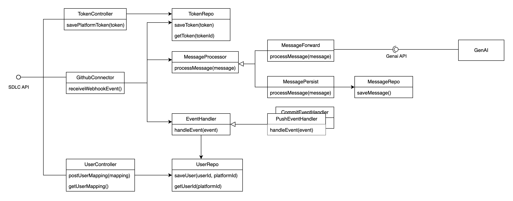
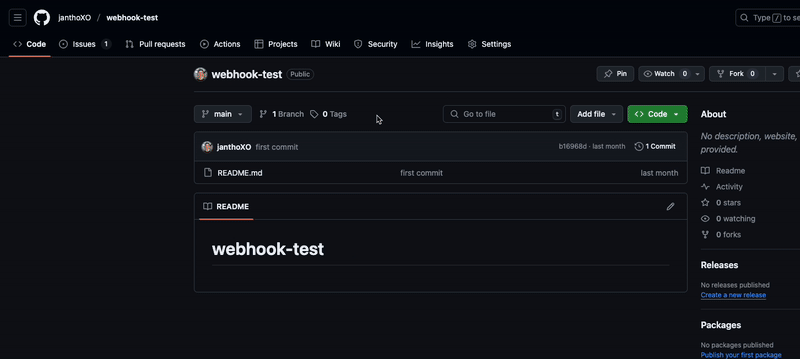
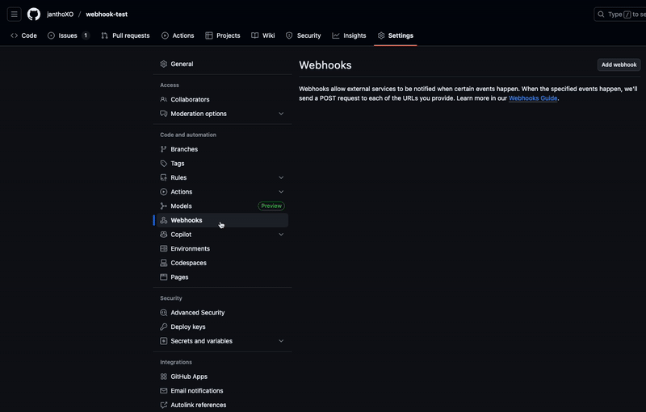

# Software Development Life Cycle (SDLC) Connector

The SDLC Connector connects to various tools and services used in the software development life cycle like Github. It receives events from these tools and forwards them to the GenAi service for processing.

## Table of Contents

- [Setup](#setup)
- [API Documentation](#api-documentation)
- [Software Design](#software-design)
- [Integration Tests](#integration-tests)
- [CI/CD Pipeline](#cicd-pipeline)
- [Github Webhook Integration Guide](#github-webhook-integration-guide)

## Setup

To test the SDLC Connector in isolation, it is best to run the `persist` profile. To do so you can use the following command:

```bash
# this will start all services with default values
docker compose up -d
```

If you want to adjust the configuration, you can create a `.env` file in the `sdlc-connector` directory based on the `.env.example` file. The `.env` file will override the default values in the `docker-compose.yml` file.

## API Documentation

Swagger API docs can be viewed at [http://localhost:8080/swagger-ui/index.html](http://localhost:8080/swagger-ui/index.html) after microservice start.

**Note**: If the project is run using `../docker-compose.local.yml`, the docs can be accessed via [http://localhost:8081/swagger-ui/index.html](http://localhost:8081/swagger-ui/index.html).

## Software Design

The SDLC Connector is designed to be modular and extensible. It uses a typical Spring Boot architecture with controllers, services, repositories, and entities. The connector listens for events from various tools and services, processes them, and persists them or forwards them to the GenAi service.

The general structure of the SDLC Connector is as follows:

The `GithubConnector` listens to events from Github via webhooks. Depending on the event type, it forwards it to the corresponding `EventHandler`. The EventHandler process the event and converts the Github user into the trace user id. The processed event is then wrapped into a Message Model. The `MessageModel` is then either sent to the GenAi service for further processing and persisting or directly persisted in the microservice's DB (depending on the profile). \
Furthermore a secret token can be set to verify the authenticity of the incoming events. This is done by setting the `X-Hub-Signature-256` header in the request. The secret token can be set via the `TokenController`.

## Integration Tests

There are tests implemented that test the functionality of each endpoint separately. This is implemented using the Spring MVC test framework (`MockMvc`).

## CI/CD Pipeline

The CI/CD pipeline is set up to automatically build and test the SDLC Connector. It uses GitHub Actions to run the tests and build the java application on every PR to the main branch. The package action extends this functionality and additionally builds a Docker image and pushes it to the Docker Hub repository. This action is triggered on every push to the main branch.

## Github Webhook Integration Guide

1. First navigate to the settings of your Github repository and select "Webhooks" from the sidebar.
   
2. Click on "Add webhook" to create a new webhook.\
   Input the public URL of the SDLC Connector as the "Payload URL".\
   Set the "Content type" to `application/json` and select the events you want to receive.\
   The Secret has to be set to the token sent to the POST token endpoint of the `TokenController`.\
   
